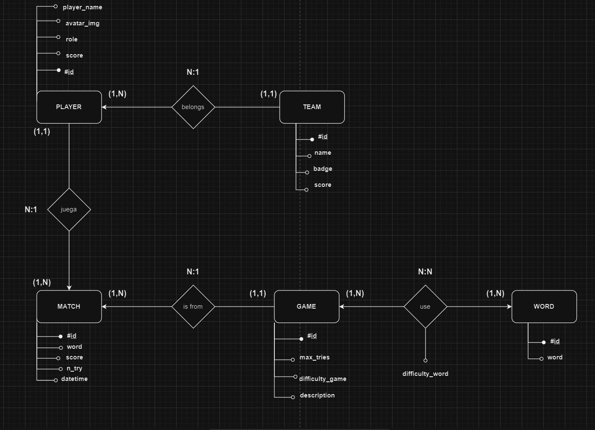
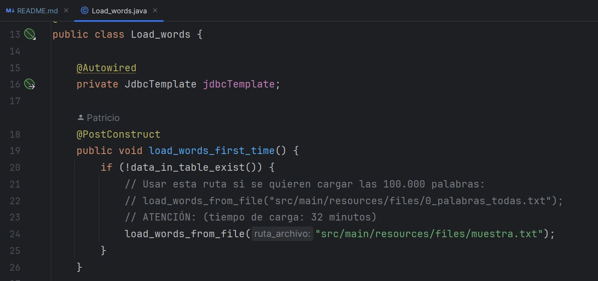

# API WORDS

****

###### DWES T4 - PROYECTO JUEGO PALABRAS

##### *Por Patricio Cifredo*

*****

****

1 - Introducción
=
***

> Para este trabajo debíamos realizar una *APIREST* con Spring Boot
> enfocada a gestionar información relacionada con juegos de palabras
> al estilo *wordle* o *juego del ahorcado*. En ella crearemos los endpoints
> de los equipos, los jugadores, las partidas, los juegos y las palabras.

> El modelo entidad-relación en el que nos hemos basado es el siguiente:
> 

> [!IMPORTANT]
> Para el desarrollo de la API he usado una muestra de palabras inferior
> a la total para mejorar las pruebas y el despliegue.
> Aun así, el *archivo completo* con todas las palabras está en el proyecto,
> solo habría que cambiar un nombre de archivo por otro:
> 

2 - Endpoints
=
***

> Los endpoints desde los que podemos acceder a los recursos de la API son:

#### Endpoints API-WORDS

| Endpoint           | Resultado                       | Método |
|--------------------|---------------------------------|:------:|
| `/api/players`     | Muestra todos los jugadores     |  GET   |
| `/api/player/{id}` | Muestra 1 jugador por su id     |  GET   |
| `/api/teams`       | Muestra todos los equipos       |  GET   |
| `/api/team/{id}`   | Muestra 1 equipo por su id      |  GET   |
| `/api/match/{id}`  | Muestra 1 equipo por su id      |  GET   |
| `api/word/{X}`     | Muestra X palabras aleatorias   |  GET   |
| `/api/player`      | Crea un jugador                 |  POST  |
| `/api/team`        | Crea un equipo                  |  POST  |
| `/api/match`       | Crea una partida                |  POST  |
| `/api/player/{id}` | Borra un jugador por su id      | DELETE |
| `/api/team/{id}`   | Borra un equipo por su id       | DELETE |
| `/api/match/{id}`  | Borra una partida por su id     | DELETE |
| `/api/player/{id}` | Actualiza un jugador por su id  |  PUT   |
| `/api/team/{id}`   | Actualiza un equipo por su id   |  PUT   |
| `/api/match/{id}`  | Actualiza una partida por su id |  PUT   |

3 - Security
=
***

> [!TIP]
> ¡La implementación de la seguridad puede ser visualizada en la
> rama user!
>> **Enlace a la rama**: **https://github.com/Patcire/API-Words/tree/user/src/main/java/com/example/apiwords/security**

> La seguridad no está 100% implementada, pues me ha dado
> errores a la hora de restringir los accesos según el rol.
> Esto se debía a que por algún motivo Spring Boot era incapaz de
> de crear la tabla de los roles asociados a la entidad *User*. La cuál
> spring boot debería ser capaz de generar con las anotaciones
> lombok implementadas en dicha clase.

> Aun así, como se puede comprobar, la mayoría de la lógica e implemetanción
> para un correcto funcionamiento de Spring Security Basic está realizada.

> [!WARNING]
> La rama *user* en la que implemento Spring Security trabaja
> en una versión inferior de Java a la de la rama principal.
> Esto es debido a que era necesario para su funcionamiento,
> ya que muchas de las funciones y métodos de Spring Boot
> Security están actualmente obsoletos.
> Por tanto, tener esto en cuenta a la hora de probar esa rama,
> ya que puede provocar choque de dependencias/versiones respecto a la
> rama main.

4 - Pruebas de la API
=
*** 

> Las distintas pruebas realizadas a los endpoints de la API
> se han comprobado mediante *Insomnia*.
> > **El archivo JSON con ellas se encuentra:
> > https://github.com/Patcire/API-Words/tree/main/src/main/java/com/example/apiwords/Tests_Insomnia**

***
***
***

